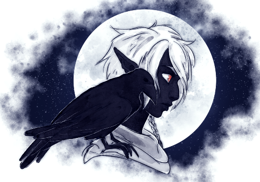

Séria eu louco ou apenas um sobrevivente?, seria eu um ser extremamente inteligente ou um retardado? Não sei, e sendo bem sincero, eu nem me importo. Meu nome é Erevran, venho das terras de baixo, vivi nas terras drow por muitos anos, então, se você consegue me julgar pelas coisas que faço aqui em cima, não imagina o que aconteceu comigo lá embaixo. Nasci como homem (que infelicidade pra mim ao menos), mulheres drows recebem todo o tipo de beneficio na vida, treino e todo o poder de escolha, nós principalmente nós que não somos nobres, simplesmente somos um bando de objetos usados para escravidão e para gerar suas filhas, pois caso um homem nasça o mesmo só vai ser jogado na sarjeta junto com seu pai, aquele incapaz de gerar uma verdadeira sacerdotisa da grande aranha.Eu lembro muito bem do que vi lá embaixo, são puros demônios os tipos de criaturas que saem daquele abismo, eu sei que nossas mulheres lutam contra eles impedindo seus avanços contra nossas vidas, mas eu não quero sobreviver, eu quero viver!!
Quando fui obrigado a ser casado simplesmente porque fui encontrado no meio da rua por uma drow de alta classe, passei anos sendo torturado, obrigado a servir como escravo para essa mulher, foram pelo menos 3 filhos homens, até que uma filha nascerá dessas tentativas, depois disso, fui jogado na sarjeta para unicamente para tentar ser usado de novo depois de um tempo. Eu não aguentava mais, então depois de muito tempo, eu consegui da um jeito de fugir de lá, quer dizer, "fugir", tudo que lembro era de umas 2 flechas nas costas que tomei enquanto corria desesperado para tentar fugir de lá, eu sabia que elas nunca iriam me deixar em paz, para elas, eu era o bichinho que tinha fugido, que tinha desobedecido. Ainda lembro daquelas aranhas sendo cavalgadas. Cheguei em uma cidade, totalmente lascado e machucado, querendo apenas um pouco de comida, ninguem ali gostava de mim, principalmente pois eu era um elfo estranho, negro que ainda estava pingando de sangue. Felizmente eu encontrei um grupinho, que me acolheu, lembro disso como se fosse a uns 20 anos atras, e possivelmente tenha sido mesmo.Com eles eu aprendi a viver nesse mundo de cima, que tinha que ser esperto para ficar vivo aqui em cima, mas ao menos eu tinha a chance de tentar fazer algo, eu me sentia finalmente liberto. Meu primeiro instinto, foi mudar meu nome, Erevran seria caçado, então mudará para Absmiliard e como me chamavam nas ruas, Dedo empoeirado, eu amo meus nomes, principalmente porque fui eu que escolhi.Entrei em uma guilda chamada "sombra da lua", estranhamente eu me dei bem com o lugar, da pra ficar bebado e me esconder de tudo e qualquer coisa, mas o que me da mais medo é que eu tenho certeza que serei caçado, e que sempre serei perseguido, então, mesmo eu tendo ajudado a erguer essa guilda, eu vivo totalmente nos esgotos, é escuro, me lembra de casa, mas ao menos eu posso esconder meu cheiro com os ratos, que inclusive são bem gostosos. Temo cada aranha que passa, e as vezes gosto de fazer um sacrificio ou outro para a grande aranha, tenho medo dela dizer onde eu estou para as outras, contudo eu tenho mais serviços para fazer do que ficar me preocupando com uma deusa que sabe-se lá se vai fazer algo por mim.Um grande ladino triste que quer resolver tudo por dinheiro e tudo que queria era ser livre, que mantem uma guilda de ladinos viva e que adora as formas de como resolve as coisas, é exatamente isso que eu sou, um maluco provavelmente, mas, EU TO VIVO CARAI!.